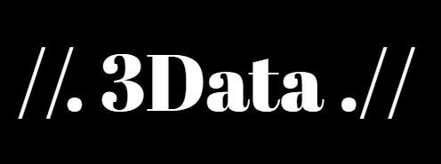
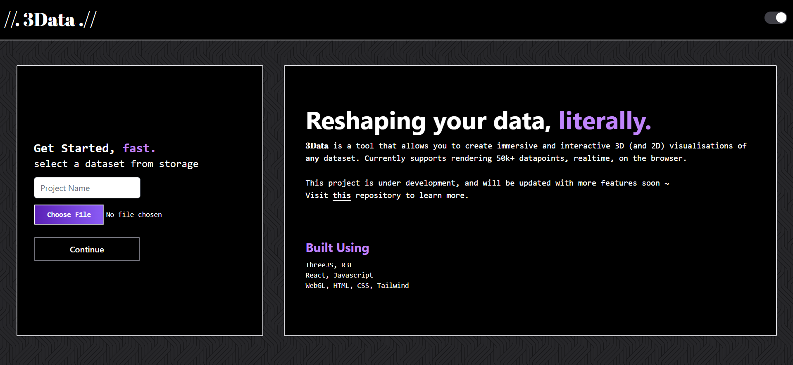
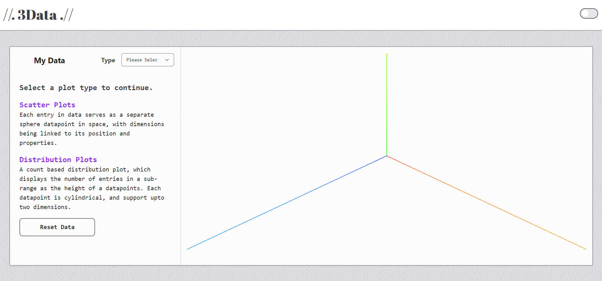

# <span style = "font-weight: bold; font-family: Tahoma;"> //. 3Data .// </span>

> The latest version of 3Data is now Live! Check out the latest [changes](./README_v1.1.md)

Good 3D visualisation tools are hard to come by. While there are a number of amazing 2D visualisation tools and libraries, 3D is definitely still a step behind, with most technologies akin to slow, and overkill CAD like software, with a heavy absence than any to-the-point data plotting service.

Building a tool, on the other hand, involves at a minimal baseline understanding of math, statistics, data science, along with the necessary programming and development skills.

## Introduction




3Data (*Three Data*) is a robust web tool that aims to provide multidimensional visualisations of any user provided dataset on the web.

Other places to check out:

- **The live tool at [this link](https://3data.netlify.app/).**

- **A lengthy [retrospective devlog](./README_long.md).**

- **Example [dataset analysis](./examples.md).**

- **Latest [Change Log](./README_v1.1.md)**



Main features include:
- Realtime rendering of more than `250k` datapoints.
- `Five` available dimensions to plot data simultaneously.
- Different types of `plots` and functionalities.
- `Superfast`, due to fully asynchronous layout computations.
- Being a fully client side application, `highly secure`. 

> **Note**: Currently supported types include: `.csv`, `.xlsx`, `.json` ( non-heirarchical JSONs)

## Tech Stack

- **Languages**
    - JavaScript 
    - HTML & [Tailwind CSS](https://tailwindcss.com/)

- **Frameworks & Libraries**
    - [`React`](https://react.dev/): Prominent front-end JS framework/library.
    - [`ThreeJS`](https://threejs.org/): Awesome cross-platform WebGL API/Library.
    - [`React Three Fiber`](https://r3f.docs.pmnd.rs/getting-started/introduction): Highly resourceful react renderer for three.js.
    - [`DanfoJS`](https://danfo.jsdata.org/): High-performance data manipulation API/library in JS (similar to `pandas`, & built for smooth integration with `Tenserflow.js`)

## Local Setup
In order to setup the project on your local machine, follow the following steps:
- Clone this repository
- Navigate to the directory with using Command Prompt or a code editor of your choice.
- Navigate to the `Context-theme` sub-folder.
- Run `npm install` to fetch the dependencies.
    - In case you do not have Node Package Manager installed, download it from [this link](https://nodejs.org/en/download/prebuilt-installer).
- Run `npm run dev` to start the development server.

## Overview & Usage Reference



### Datapoints 
Datapoints refers to the individual meshes placed in 3D space. The meshes involve spheres, for scatter plots, and cylinders for distributions. 
> *While the website does support custom models (and contains the necessary components to load them), I do not see a utility for it just yet.*

### Plot Types
Currently there are two types of supported plots:

- **Scatter Plot**
    
    Each entry in data serves as a separate sphere datapoint in space, with dimensions being linked to its position and properties.

- **Distribution Plot**

    A count based distribution plot, which displays the number of entries in a sub-range as the height of a datapoints. Each datapoint is cylindrical, and support upto two dimensions.

    - In case of a single dimensions, the graph can be seen as a discretized maxwell distribution plot, just based on the provided column.
    - For two dimensions, the same correlation follows, and plots a datapoint for each existing unique pair of the two dimensions.

### Dimensions

Dimensions in 3Data are mapped to columns in the selected dataset. A plot type allows for a certain number of dimensions, based on what the type is for.

Scatter Plots support five main dimensions to plot data:
```
- 3D Axes (Color coded to RGB)
    - X axis (Necessary)
    - Y axis
    - Z axis
- Datapoint Properties:
    - Color
    - Scale
```
Distribution Plots support two dimensions:
```
- X axis(Necessary)
- Z axis
```

### Data Types

Each Axial field needs to be assigned a data type, which will result in corresponding functions being applied to it.

- **Continuous Data**: Contains continuous mathematical values, which follow a certain order, such as a range of integers, floats, etc.. The **Scale** axis is continuous only.
- **Categorical Data**: Refers to discrete data, which does not contain any solid mathematical relation between the values. Can be a string.
- **Index**: For fields where an axis requires a single datapoint on it, in a continuous manner. An example can be the date. (more suitable for 2D plots)

The **Color** field automatically infers the datatype, between continuous and categorical data, and lerps the hue between two colors: Low for red, and Light Blue for High.

> An error alert is thrown to notify the user of any incompatible choices.

## Examples

- ### World Happiness Report 2019 - [Analysis](./examples.md#world-happiness-report-2019)
    
    While this dataset is relatively smaller in size with `156` datapoints, given the number of countries is the maximum number of datapoints, it works really well in displaying different aspects of 3Data, without overcomplicating things.
    

- ### Student Performance Dataset (Rabie El Kharoua, 2024) - [Analysis]() 

    This interesting dataset contains data from roughly `2,392` high school students, with an diverse array of metrics and classifications, that involve demographics, study habits, parental involvement, extracurricular activities, and academic performance.

## What's Next?. 

For readers - *Try it out, and let me know!*

Raise an issue to contribute, or if there's any features that are a must.

Given the generalized nature, there's an unending number of features that can be added, including several features that are a necessity to provide a great user experience.

Thus, focusing on the second half, before jumping to huge functional additions, the following tasks take precedence over others, and I will try to implement them in the near future:
- Labelling axes with respect to the data and current visualisation.
- Helper graphics, such as pointers to select and view individual datapoints, camera snapping controls, etc..
- Lots of animations, and custom shader support for the viewport.
- Optimisation of current methods to support even larger datasets.